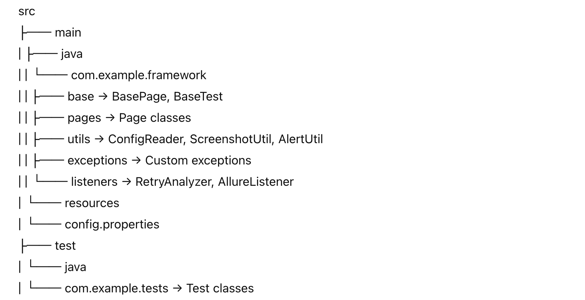

# selenium-pom-java
# mvn clean install
# allure serve allure-results

# 🔍 Selenium Java Test Automation Framework

This is a scalable and modular Selenium-based automation framework using Java, TestNG, Maven, and Allure Reports. Built with Page Object Model (POM), BasePage abstraction, custom wrapper methods, retry logic, and extensible utilities.

---

## 📦 Tech Stack

| Component          | Tech Used                |
|-------------------|--------------------------|
| Language           | Java 17+                 |
| Build Tool         | Maven                    |
| Test Framework     | TestNG                   |
| Automation         | Selenium WebDriver       |
| Reporting          | Allure Report            |
| Design Pattern     | Page Object Model (POM)  |
| DI (Optional)      | Spring Framework         |
| Logging            | Log4j2                   |

---

## 🔧 Features

✅ PageFactory-based Page Classes  
✅ Reusable `BasePage` with wrapper methods (click, type, select, wait)  
✅ Retry logic on test failure  
✅ Screenshot on failure (Allure attachment)  
✅ Centralized properties reader  
✅ TestNG Listeners & `RetryAnalyzer`  
✅ Abstract `BaseTest` and `BasePage` with OOP  
✅ Spring Dependency Injection support (optional)  
✅ Auto-generated Allure Reports with environment metadata  
✅ Utility classes for file copy, alert handling, auth popups, etc.

---

## 📁 Project Structure




---

## 🚀 Getting Started

### 1. Clone the repo
```bash
git clone https://github.com/yourusername/selenium-java-framework.git
cd selenium-java-framework

2. Run tests

mvn clean test

3. View Allure Report

allure serve target/allure-results

@Test(description = "Verify login functionality")
public void loginTest() {
    loginPage.login("admin", "admin123");
    Assert.assertTrue(dashboardPage.isLoggedIn());
}

📊 Add Allure Environment Info

src/test/resources/environment.properties

Create a file at:
src/test/resources/environment.properties

Example content:
Environment=QA
Browser=Chrome
BaseURL=https://qa.example.com

It will be automatically copied to target/allure-results.

🧰 Utilities Included

    ScreenshotUtil (with Allure support)

    ConfigReader

    Alert handling

    JavaScript popup auth handler

    File copy/image creation

    Environment metadata injector

    RetryAnalyzer for flaky tests

🧱 Dependencies

mvn clean install

Ensure these are installed:

    Java 17+

    Maven 3.6+

    Allure CLI (allure --version)

💬 Contribution

Contributions and improvements are welcome! Feel free to fork, branch, or submit PRs.


